# Stage 2: Databases and Plotting

In this section, you'll dump your DataFrames to a SQLite database.
You'll answer questions by doing queries on that database.  Often,
your answer will be in the form of a plot.  Check these carefully, as
the tests only verify a plot has been created, not that it looks
correct (TAs will manually deduct points for plotting mistakes).

Create your database by pasting the following cell to your notebook.

```python
import sqlite3
conn = sqlite3.connect('countries.db')
countries.to_sql("countries", conn, if_exists="replace", index=False)
capitals.to_sql("capitals", conn, if_exists="replace", index=False)

# remember to do conn.close() at the end of your notebook
```

If you named your DataFrames something other than `countries` and
`capitals`, tweak the above code to use your variable names.

#### Question 16: In our dataset, how many countries are in each continent?

Look at the `Question 16` table in `expected.html`.  Your answer
should be a DataFrame with the same rows and columns.  It should look
like this:

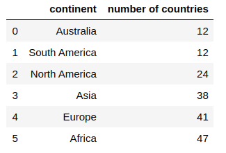

Requirements:
* use a GROUP BY query in SQL
* sort by number of countries (least first)
* break ties alphabetically ("A" before "B", etc)
* the column names should be `continent` and `number of countries`

Use backtics (`` ` ``) around column names with spaces to satisfy the
last requirement.  You should also use the backtics to deal with
column names containing other problematic characters as well (e.g.,
`-`).

#### Question 17: How many countries are in each continent? (answer with a plot)

Answer with a **bar plot**. Put continents on the x-axis and number
of countries on the y-axis. The continents should be sorted along the
x-axis in ascending order by the number of countries and then alphabetically by name.

**Expected output:**

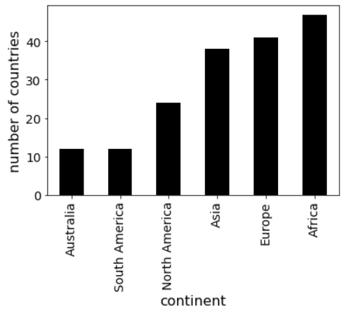

#### Question 18: What is the total area of each continent?

For this question, you should calculate the total area of every continent
and display the `continent` name and total area of the continent (using a
column named `total area`). The results should be displayed in *descending* order of the
column `total area`.

**Expected output:**

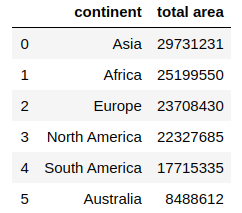

#### Question 19: What is the total area of each continent? (answer with a plot)

Answer with a **bar plot**. Put continents on the x-axis and total
area on the y-axis.  The continents should be sorted along the
x-axis in *descending* order of the column `total area`.

**Expected output:**

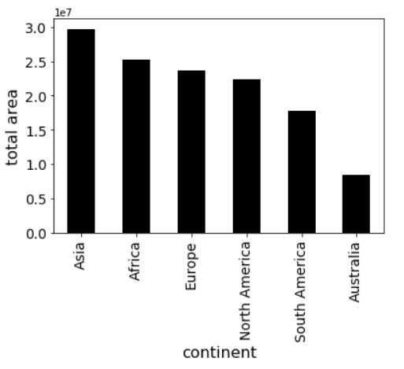

#### Question 20: What is the area of each country in South America?

You should display the `country` name and `area` of the countries. The results should be displayed in *descending* order of the column `area`.

**Expected output:**


#### Question 21: What are the top 8 countries that have the largest real GDP?

You should display the `country` name and `real GDP (billion)` of the top 8 countries that have the largest real GDP. These top 8 countries should be
displayed in *descending* order of real GDP.

Hint: `real GDP = population * gdp-per-capita`

**Expected output:**

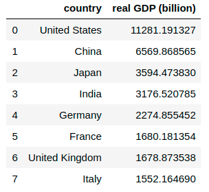

#### Question 22: What are the top 8 countries that have the largest real GDP? (answer with a plot)

**Expected output:**

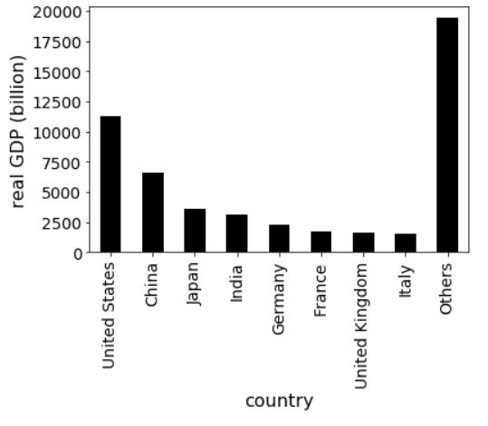

Make sure to include the "other" category.

#### Question 23: What is the relationship between GDP per capita and net-migration?

Answer with a **scatter plot** with `gdp-per-capita` on the x-axis and `net-migration` on the y-axis.

**Expected output:**

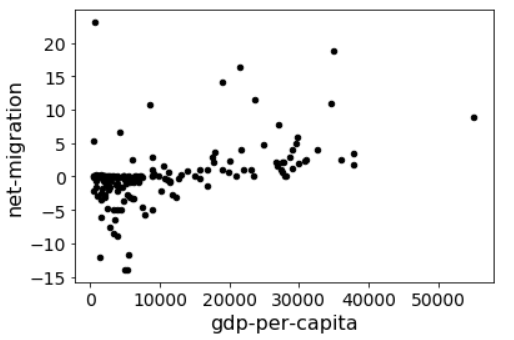

#### Question 24: What is the correlation between GDP per capita and number of phones per capita?
If you have a DataFrame `df`, then calling `df.corr()` will present a table showing the Pearson correlation between every pair of columns in df. A correlation of 1 is the max (so, for example, every column is correlated perfectly with itself). A high correlation between columns X and Y means that large X values tend to coincide with large Y values and small X values tend to coincide with small Y values. In some of the questions, you'll observe negative correlations (-1 being the smallest). This means that large X values tend to coincide with small Y values and vice versa.

Does this correlation value coincide with the pattern you saw in question 23? 

**Expected output:**

`0.45232113250112843`

#### Question 25: What is the relationship between GDP per capita and death rates?:
Answer with a **scatter plot** with `gdp-per-capita` on the x-axis and `death-rate` on the y-axis.

**Expected output:**

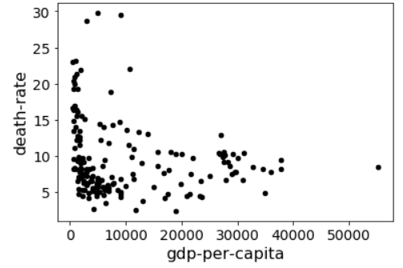

#### Question 26: What is the relationship between infant-mortality and GDP per capita?

Answer with a **scatter plot** with `infant-mortality` on the x-axis and `gdp-per-capita` on the y-axis.

**Expected output:**

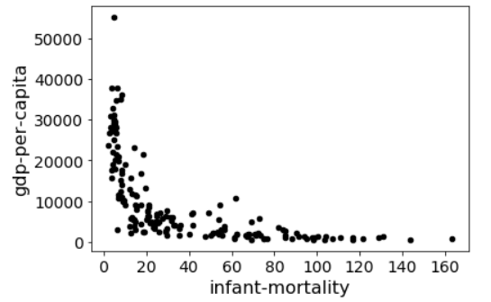

#### Question 27: What is the relationship between inverse of infant-mortality and GDP per capita?

Answer with a **scatter plot** with `inverse infant-mortality` on the x-axis and `gdp-per-capita` on the y-axis.

Hint: `inverse infant-mortality` is defined as `1 / infant-mortality`

**Expected output:**

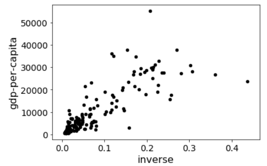

#### Question 28: fit a `y = m * x + n` line to the scatter plot in question 38 using the least-squares method; what are the coefficients m and n?

For the regression line, first try copy/pasting this code into a notebook cell and running it to see what happens:

```python
import numpy as np

df = DataFrame({
    "x": [1,2,3,4],
    "y": [2,5,6,5]
})
df["1"] = 1

res = np.linalg.lstsq(df[["x", "1"]], df["y"], rcond=None)

# res is a tuple: (COEFFICIENTS, VALUE, VALUE, VALUE)
coefficients = res[0] # coefficients is (m,n:
m = coefficients[0] # slope
n = coefficients[1] # intercept
ax = df.plot.scatter(x='x', y='y')

df["fit"] = df["x"] * m + n
df.plot.line(x='x', y='fit', c='red', ax=ax)
```

Then adapt the above code so that it uses your DataFrame (instead of
df) and replaces "x" with `inverse infant-mortality` and "y" with `gdp-per-capita`. Answer with a **tuple** for coefficients `(m, n)`.:

**Expected output:**

`(107087.18867997837, 1587.9379639672552)`

#### Question 29: When `inverse infant-mortality = 0.5`, what is the expected value for `gdp-per-capita`?

**Expected output:**

`55131.53230395644`

#### Question 30: plot the regression line to the scatter plot

To visualize how well the regression line fit the scatter points, draw a fit line over the **scatter plot**.

**Expected output:**

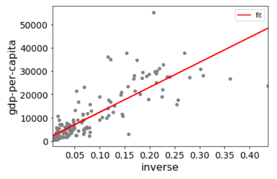
