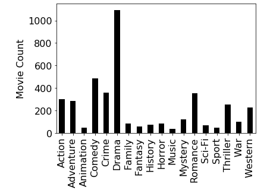
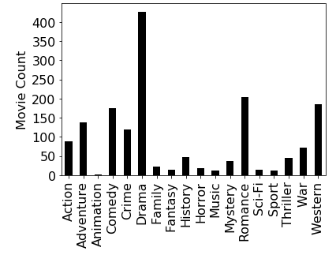
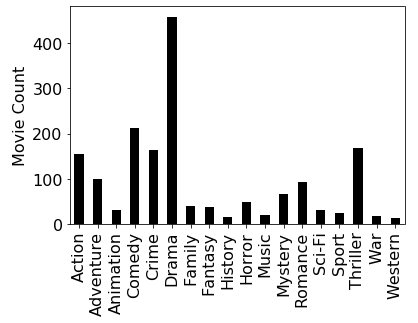
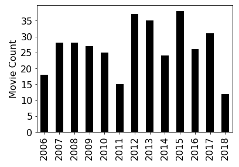

# Stage 2: Bucketing and Summarizing

In stage 1, you took data in a cumbersome form (everything was a
string and the data contained IDs instead of names) and converted it
to something more useful, namely lists of movie dictionaries.  In this
stage, you'll be doing analysis on data in that more useful form.
Much of your analysis will take the form of categorizing (aka
bucketing) movies, then computing simple stats over each bucket.  Some
movies will belong to multiple buckets (for example, a movie with
multiple genres, in the case that we're categorizing by genre).

Note that some questions involve creating plots.  Our tests can only
detect the whether a plot has been created, not whether the plot
matches our requirements, so double check for yourself that the plots
look correct to avoid deductions during code review.

## Implementing the `bucketize` Function

Implement the following function:

```python
def bucketize(movie_list, movie_key):
    # TODO: return dict of lists of movie dicts
```

The `movie_list` parameter accepts a list of dictionaries, such as
those in the `movies` or `small` variables from stage 1.  To refresh
your memory, `small` should look like this:

```
[{'title': 'Runaway Jury',
  'year': 2003,
  'rating': 7.1,
  'directors': ['Gary Fleder'],
  'actors': ['John Cusack', 'Gene Hackman', 'Dustin Hoffman'],
  'genres': ['Crime', 'Drama', 'Thriller']},
 {'title': 'Lethal Weapon',
  'year': 1987,
  'rating': 7.6,
  'directors': ['Richard Donner'],
  'actors': ['Mel Gibson', 'Danny Glover', 'Gary Busey', 'Mitchell Ryan'],
  'genres': ['Action', 'Crime', 'Thriller']}]
```

The `movie_key` parameter should refer to some key that exists in
every dictionary in `movie_list`.  For example, for the above
dictionaries, `movie_key` might contain "title", "year", "actors",
etc.

The result returned by the `bucketize` should be a dictionary of
lists.  The **keys** of the result dictionary should be the values of
the `movie_list` dictionaries that are looked up by `movie_key`.  For
example, if `movies_list` refers to the `small` data shown above and
`movie_key` is "year", then the keys in the returned dictionary will
be 2003 and 1987 because `movies_list[0][movie_key]` is 2003 and
`movies_list[1][movie_key]` is 1987.

The **values** of the returned dictionary will be lists of movie
dictionaries from `movies_list`.  For example, suppose the following
call is made:

```python
buckets = bucketize(small, "year")
```

In this case, `buckets[2003]` will be a list of movie dicts for the
movies made in 2003 (in this case, just *Runaway Jury*).  Concretely,
`buckets` should be the following:

```
{2003: [{'title': 'Runaway Jury',
   'year': 2003,
   'rating': 7.1,
   'directors': ['Gary Fleder'],
   'actors': ['John Cusack', 'Gene Hackman', 'Dustin Hoffman'],
   'genres': ['Crime', 'Drama', 'Thriller']}],
 1987: [{'title': 'Lethal Weapon',
   'year': 1987,
   'rating': 7.6,
   'directors': ['Richard Donner'],
   'actors': ['Mel Gibson', 'Danny Glover', 'Gary Busey', 'Mitchell Ryan'],
   'genres': ['Action', 'Crime', 'Thriller']}]}
```

**Special Case:** if `m[movie_key]` for a movie `m` in `movie_list` is
a list, then `m` should end up in multiple lists in the returned
dictionary.  For example, suppose this code is run:

```python
buckets = bucketize(small, "genres")
```

In this case, `buckets["Crime"]`, `buckets["Drama"]`, and
`buckets["Thriller"]` will all contain the movie dict for *Runaway
Jury*, because that movie has three categories and therefore belongs
in multiple categories.

The first couple questions just involve testing your `bucketize`
function, which should work with any list of dicts (even those not
technically describing movies).  To get some test data, paste the
following cell:

```python
test_movies = [
{"title": "A", "year": 2018, "style": "short", "genres": ["g1"]},
{"title": "B", "year": 2018, "style": "long",  "genres": ["g2"]},
{"title": "C", "year": 2019, "style": "short", "genres": ["g3"]},
{"title": "D", "year": 2019, "style": "long", "genres": ["g1", "g2", "g3"]},
]
```

#### #Q21: What is `bucketize(test_movies, "style")`?

Expected answer:

```
{'short': [{'title': 'A', 'year': 2018, 'style': 'short', 'genres': ['g1']},
  {'title': 'C', 'year': 2019, 'style': 'short', 'genres': ['g3']}],
 'long': [{'title': 'B', 'year': 2018, 'style': 'long', 'genres': ['g2']},
  {'title': 'D', 'year': 2019, 'style': 'long', 'genres': ['g1', 'g2', 'g3']}]}
```

Note that the *A* and *B* dictionaries are in the 2018 bucket and *C*
and *D* are in the 2019 bucket.

#### #Q22: What is `bucketize(test_movies, "year")`?

Expected answer:

```
{2018: [{'title': 'A', 'year': 2018, 'style': 'short', 'genres': ['g1']},
  {'title': 'B', 'year': 2018, 'style': 'long', 'genres': ['g2']}],
 2019: [{'title': 'C', 'year': 2019, 'style': 'short', 'genres': ['g3']},
  {'title': 'D', 'year': 2019, 'style': 'long', 'genres': ['g1', 'g2', 'g3']}]}
```

#### #Q23: What is `bucketize(test_movies, "genres")`?

Expected answer:

```
{'g1': [{'title': 'A', 'year': 2018, 'style': 'short', 'genres': ['g1']},
  {'title': 'D', 'year': 2019, 'style': 'long', 'genres': ['g1', 'g2', 'g3']}],
 'g2': [{'title': 'B', 'year': 2018, 'style': 'long', 'genres': ['g2']},
  {'title': 'D', 'year': 2019, 'style': 'long', 'genres': ['g1', 'g2', 'g3']}],
 'g3': [{'title': 'C', 'year': 2019, 'style': 'short', 'genres': ['g3']},
  {'title': 'D', 'year': 2019, 'style': 'long', 'genres': ['g1', 'g2', 'g3']}]}
```

This one is tricky!  Notice how movie *D* shows up in all three
buckets because we're bucketizing by genre, and *D* is falls under all
three genre categories.

#### #Q24: What is `bucketize(small, "genres")`?

Remember that `small` is where we stored the value returned by
`get_movies` in stage 1 when we loaded data from the
"small_movies.csv" file.

Expected answer:

```
{'Crime': [{'title': 'Runaway Jury',
   'year': 2003,
   'rating': 7.1,
   'directors': ['Gary Fleder'],
   'actors': ['John Cusack', 'Gene Hackman', 'Dustin Hoffman'],
   'genres': ['Crime', 'Drama', 'Thriller']},
  {'title': 'Lethal Weapon',
   'year': 1987,
   'rating': 7.6,
   'directors': ['Richard Donner'],
   'actors': ['Mel Gibson', 'Danny Glover', 'Gary Busey', 'Mitchell Ryan'],
   'genres': ['Action', 'Crime', 'Thriller']}],
 'Drama': [{'title': 'Runaway Jury',
   'year': 2003,
   'rating': 7.1,
   'directors': ['Gary Fleder'],
   'actors': ['John Cusack', 'Gene Hackman', 'Dustin Hoffman'],
   'genres': ['Crime', 'Drama', 'Thriller']}],
 'Thriller': [{'title': 'Runaway Jury',
   'year': 2003,
   'rating': 7.1,
   'directors': ['Gary Fleder'],
   'actors': ['John Cusack', 'Gene Hackman', 'Dustin Hoffman'],
   'genres': ['Crime', 'Drama', 'Thriller']},
  {'title': 'Lethal Weapon',
   'year': 1987,
   'rating': 7.6,
   'directors': ['Richard Donner'],
   'actors': ['Mel Gibson', 'Danny Glover', 'Gary Busey', 'Mitchell Ryan'],
   'genres': ['Action', 'Crime', 'Thriller']}],
 'Action': [{'title': 'Lethal Weapon',
   'year': 1987,
   'rating': 7.6,
   'directors': ['Richard Donner'],
   'actors': ['Mel Gibson', 'Danny Glover', 'Gary Busey', 'Mitchell Ryan'],
   'genres': ['Action', 'Crime', 'Thriller']}]}
```

#### #Q25: How many different unique directors appear in the `small` dataset?

**Hint:** `bucketize(small, "directors")` bucketizes movies based on directors,
so the number of buckets will correspond to the number of unique
directors.

#### #Q26: How many unique directors appear in the full dataset?

**Note:** for this and all remaining questions, answer with respect to
the full dataset referenced by the `movies` variable from stage 1
(we'll ask nothing more regarding `small` or `test_movies`).

#### #Q27: How many movies are there of each genre?

Answer with a dictionary where each key is a genre and each value is
how many movies have that genre, like this:

```
{'Comedy': 485,
 'Drama': 1094,
 'Romance': 352,
 'History': 73,
 'Family': 85,
 'Mystery': 121,
 'Thriller': 250,
 'Action': 299,
 'Crime': 357,
 'Adventure': 283,
 'Western': 226,
 'Music': 38,
 'Animation': 45,
 'Sport': 48,
 'Fantasy': 59,
 'War': 99,
 'Sci-Fi': 69,
 'Horror': 85}
```

**Hint:** many of these questions can be reframed as questions about buckets.  For example:
* how many buckets are there?
* how many items are there in each bucket?

Of what variety is Q27?

#### #Q28: How many movies are there of each genre? (plot your answer)

Yes, this is the same as Q27, but now you must answer with a plot
rather than a dictionary.  Your plot should look like this:



**Note:** For plot-based, the tests are only checking that a plot exists.  If a
plot is not correct, your reviewer will manually deduct points.

Note: We introduce how to create plots in Lab-P8b.  So if you're
working ahead, you might need to save this question until that lab has
been released.  Also, in case you missed it from the lab, if you don't
have `%matplotlib inline` in a cell, your first plot might not show up
in the notebook after a Restart & Run All.

#### #Q29: How many movies are there of each genre, prior to 1970? (plot your answer)

Your plot should look like this:



**Mediocre Hint:** Creating the right functions so that the return
  value from one call can be the argument to for another call is the key to
  doing this without writing very complicated code.  For example, you
  can solve this problem with a single line of code:
  `plot_dict(bucket_counts(filter_year(movies, None, 1970), "genres"), "Movie Count")`. 
  What code should you use for `bucket_counts` and `filter_year`?  
  Well, if we told you that, it wouldn't be be a "mediocre" hint, would it?

#### #Q30: How many movies are there of each genre, in or after 1990? (plot your answer)

Your plot should look like this:



**Another Mediocre Hint:** Your instructor solved this one with
`plot_dict(bucket_counts(filter_year(movies, 1990, None), "genres"), "Movie Count")`.

Take a moment to compare this and the previous plot.  What can you
infer?  What genres have grown in popularity?  Which ones have fallen
out of favor in recent years?

#### #Q31: How many movies have there been per year, after (not including) 2005? (plot your answer)

Your plot should look like this:



**Hint:** if you've written a general function to help with the previous
questions and you've kept the relevant data in a variable, you can
answer this with one simple line of code.

#### #Q32: What are the acting career spans of the actors who have acted for at least 45 years?

The span is the difference in years between year of the first movie
they acted in and the last one they acted in (so if they only ever
acted in one year, the span is 0).  Answer with a dictionary,
mapping name to years worked.  It should look like this:

```
{'Robert De Niro': 49,
 'Kurt Russell': 50,
 'John Wayne': 46,
 'Mickey Rooney': 75,
 'Robert Mitchum': 51,
 'Henry Fonda': 46,
 'Glenn Ford': 52,
 'Jeff Bridges': 48,
 'James Caan': 52,
 'Anthony Quinn': 61,
 'Marlon Brando': 49,
 'Tony Curtis': 45,
 'Ernest Borgnine': 47,
 'Rod Steiger': 45,
 'George Burns': 60,
 'Bruce Dern': 45,
 'Dean Stockwell': 53}
```

#### #Q33: What are the directing career spans of the directors who have directed for at least 25 years?

#### #Q34: Who are the top 10 actors with the longest careers?

Answer with a list of dictionaries, such that each dictionary specifies a name and span, like this:

```
[{'name': 'Mickey Rooney', 'span': 75},
 {'name': 'Anthony Quinn', 'span': 61},
 {'name': 'George Burns', 'span': 60},
 {'name': 'Dean Stockwell', 'span': 53},
 {'name': 'Glenn Ford', 'span': 52},
 {'name': 'James Caan', 'span': 52},
 {'name': 'Robert Mitchum', 'span': 51},
 {'name': 'Kurt Russell', 'span': 50},
 {'name': 'Robert De Niro', 'span': 49},
 {'name': 'Marlon Brando', 'span': 49}]
```

This is a little tricky, so we'll sketch out part of a function for
you to get you close:

```python
def row_ranking(row):
    return row["span"]

def top_n_span(buckets, n):
    # TODO: spans should be a dictionary mapping name to career span
    spans = ????
    rows = []
    for name in spans:
        span = ????
        rows.append({"name": name, "span": span})

    # we want to sort the rows so that those with the biggest spans
    # are first.  Notice that we aren't calling row_ranking, but rather
    # passing a reference to this function to the sort method.  The sort
    # method uses this function to determine how to rank the rows.
    # 
    # we do a reverse sort because we want the biggest spans first,
    # not last
    rows.sort(key=row_ranking, reverse=True)

    # TODO: return a slice of the rows
```

#### #Q35: Who are the top twenty one directors with the longest careers?

Answer with the same format as above.

#### #Q36: Who are the nine best actors?

By "best", we mean having the highest *median* movie rating (this is
true for the following questions too).

Answer with a list of length nine, containing dictionaries detailing
the name, rating (the median rating for that actor), and
count (number of movies that actor has acted in).  It should look like this
(the list should be sorted in order of decreasing rating):

```
[{'name': 'Heath Ledger', 'rating': 9.0, 'count': 1},
 {'name': 'John Fiedler', 'rating': 8.9, 'count': 1},
 {'name': 'Aldo Giuffrè', 'rating': 8.9, 'count': 1},
 {'name': 'Steven Williams', 'rating': 8.8, 'count': 1},
 {'name': 'Daniel Roebuck', 'rating': 8.8, 'count': 1},
 {'name': 'Joseph Gordon-Levitt', 'rating': 8.8, 'count': 1},
 {'name': 'Miyu Irino', 'rating': 8.6, 'count': 1},
 {'name': 'Andrew Kevin Walker', 'rating': 8.6, 'count': 1},
 {'name': 'Ken Watanabe', 'rating': 8.55, 'count': 2}]
```

#### #Q37: Who are the twelve best directors?

Consider refactoring your code
from Q36 into a function to answer this with a single call.  The
output should follow the same format, like this:

```
[{'name': 'James Marlowe', 'rating': 8.8, 'count': 1},
 {'name': 'Kirk Wise', 'rating': 8.6, 'count': 1},
 {'name': 'David Fincher', 'rating': 8.6, 'count': 1},
 {'name': 'Christopher Nolan', 'rating': 8.5, 'count': 9},
 {'name': 'Leonid Gayday', 'rating': 8.4, 'count': 5},
 {'name': 'Adrian Molina', 'rating': 8.4, 'count': 1},
 {'name': 'Stanley Kubrick', 'rating': 8.3, 'count': 11},
 {'name': 'Sergio Leone', 'rating': 8.3, 'count': 7},
 {'name': 'Satyajit Ray', 'rating': 8.2, 'count': 9},
 {'name': 'Moustapha Akkad', 'rating': 8.2, 'count': 1},
 {'name': 'Andrew Grieve', 'rating': 8.2, 'count': 6},
 {'name': 'Danny Boyle', 'rating': 8.2, 'count': 1}]
```

What do you notice about the number of movies of the highest-rated
directors (and actors)?  Is the highest median a good metric for best,
or can you think of a better metric?

#### #Q38: Who are the fourteen best actors, if we only consider those who have acted in at least 5 movies?

Can you add a parameter to a previously created function to deal with
this extra constraint (i.e., a minimum number of movies)?

#### #Q39: Who are the sixteen best actors, if we only consider those who have acted in at least 30 movies?

#### #Q40: Who are the eight best directors, if we only count directors having at least 8 movies?
