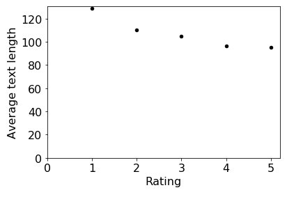
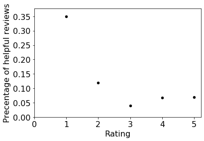
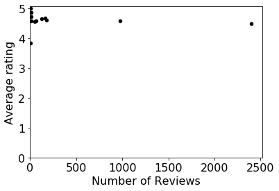
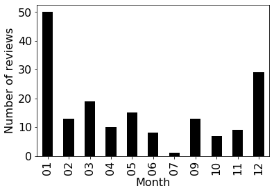
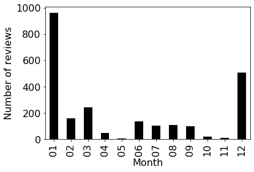

# Stage 2

We'll now use the clean data from stage 1 to analyze the reviews of the Amazon products. We'll also write some code to recursively find and process files nested inside multiple directories. To start, download and extract `broken_file.zip` in the same location of your notebook (you need to have the `broken_file` directory in the same directory as your `main.ipynb`). You will be using the broken_file from #Q25 onwards.

**Note:** You'll learn about making plots in lab 9b, so please
  don't ask about how to do that until you've had a chance to work through it.


Now would be a great time to create a bucketize function (if you haven't already
created it!). It will be extremely useful for nearly all questions in Stage 2.

If you want to access a particular column value from a namedtuple:

Consider

```python
review = Review(id=73101, username='Jhun', asin='B018Y229OU', title='Great tablet for my 3 year old twins', text='Very nice product...Had everything we were looking for...', rating=5, do_recommend=True, num_helpful=2, date='2015-11-06')
```

You can access the rating value from the above review object using `getattr(review, 'rating')`

#### #Q16: Who are the top 22 **prolific** users in this dataset?

Find the users with most reviews. Answer with a `dict` that maps username to the number of reviews by that user.

**Hint**: Start with `bucketize('username')` and proceed from there.

#### #Q17: Who are the users whose comments have been found helpful at least five times?

Answer with a `dict` that maps username to the total number of times when other people found their reviews helpful.

**Hint**: First, create a dictionary where the keys are all the usernames and
the value corresponding to each username is the *sum* of the num_helpful
attribute from all the reviews corresponding to that user.

---

**Warning:** Remember that `test.py` can only detect whether you have a plot or not. It cannot check if your plot is correct. If your plots are incorrect, you will lose points. Check your answers with the plots provided below.

#### #Q18: What is the relationship between the rating and the average text length?

Answer with a scatter plot. The x-axis should represent the rating and the y-axis should represent the average text length of a review with that rating.

**Hint**: Start with `bucketize('rating')` and proceed from there.

Your plot should look like this:



Using this plot, can you infer the rating of a review given its text length? See if this pattern holds for title length as well. If not, look at the data and try to you explain why.

#### #Q19: What is the relationship between the rating and the likelihood of the review being helpful?

Answer with a scatter plot. The x-axis should represent the rating and the y-axis should represent the percentage of reviews that were found helpful by at least one person.

Your plot should look like this:



What ratings are the most helpful and what ratings are the least helpful? Why could that be?

#### #Q20: Find the average rating of each product.

Answer with a `dict` that maps the name of a product to its average rating across all reviews.

**Hint**: You can use `bucketize` here as well. How?

#### #Q21: What is the relationship between the number of reviews and the average rating of a product?

Answer with a scatter plot showing all of the products. The x-axis should represent the number of reviews, and the y-axis should represent the average rating. It should look like this:



As you can see, there are two outliers on this graph with a very high number of reviews, that make it difficult to make out the other points on the graph.

#### #Q22: Remove the outliers from the last plot.

A product with more than 500 reviews can be considered to be an outlier.
Your plot should look like this:


Do you see any interesting patterns here? Why do you think the products with the least number of reviews have the most variance in their average rating?


#### #Q23: What is the relationship between the month and the total number of reviews for the product 'Fire Kids Edition Tablet, 7 Display, Wi-Fi, 16 GB, Pink Kid-Proof Case' for each month?

Answer with a bar plot. The x-axis should represent the month and the y-axis should represent the total number of reviews for the given product in that month.

Your plot should look like this:



#### #Q24: What is the relationship between the month and the total number of reviews for the product 'Fire Tablet, 7 Display, Wi-Fi, 8 GB - Includes Special Offers, Magenta' for each month?

Answer with a bar plot. The x-axis should represent the month and the y-axis should represent the total number of reviews for the given product in that month.

Your plot should look like this:



----
Now, we have some good news! The data from the JSON file that was broken(`review3.json`) has been found! Unfortunately, the data is not stored in a single JSON file. It has instead been broken down into multiple files and stored inside the directory `broken_file`. Explore this directory using Finder or Explorer to see how the data is stored there.

Write a function that takes a directory path as a parameter,
recursively explores that directory for any files (which might be
buried in many levels of sub directories), and finally returns a list
of paths to files inside that directory. The paths should be sorted
in *reverse-alphabetical order*. Exclude any files with names beginning
with `.`.

**Important:** there are Python functions that can do this for you
  (for example, https://docs.python.org/3/library/os.html#os.walk),
  but you need to write the recursive code for yourself.  If you use
  one of these existing implementations, we'll deduct any points you
  get for the remaining questions.

Your function MAY use the following:
* `os.listdir`
* `os.path.join`
* `os.path.isfile`
* `os.path.isdir`

**Hint**: In Lab 9b, you created a recursive function to solve Problem 4. You need to do something very similar here.

Use your function to answer the following.

----

#### #Q25: List the paths in the `very_helpful` directory of `rating4` of `broken_file`.

For this and the following questions, please sort in reverse-alphabetical order.
You could use the recursive function created above for this and the following functions.

#### #Q26: List the paths of all the files in the `rating5` directory of `broken_file`.

List the paths of the files inside the directory, as well as the paths
of all files inside any sub-directories.

You must use the recursive function to find these (remember to cite
anything you use if you base your function on code you find online or
in an example we provide).

#### #Q27: List the paths of all the files in the `broken_file` directory.

List the paths of the files inside the directory, as well as the paths
of all files inside any sub-directories.

#### #Q28: Combine all the files in `broken_file` directory and find the number of unique products being reviewed in these files.

**Hint**: Your function should read the files listed in the previous question one by one. As these are json files, you can read them to a dictionary. Now, go through the elements of the dictionary and add these elements to a master dictionary to combine the data from all the files. This would also be useful for the next few questions.
You can use the combined data (which is in the form of a dictionary) to get the unique products being reviewed. To get the unique products being reviewed in these files, count the number of unique asin ids in the combined dictionary.

-----

Let us now combine the data we found in `broken_file` with the original data. Use the data from `broken_file` along with `review3.csv` to create Review objects corresponding to the reviews in `review3.csv`.

#### #Q29: Combine all the files in the directories `data` and `broken_file`, and find the total number of reviews.

**Hint**: You can still use your `get_reviews` function defined in stage 1. Write the data gathered from the directory `broken_data` into a new json file (say `broken_data.json`), and then use `get_reviews('review3.csv', 'broken_data.json')` to parse the data. Then do not forget to delete the new file using the command `os.remove('broken_data.json')`, so it does not affect your answers to any of your other questions.

#### #Q30: What is the percentage of change in the average rating changed for the product 'Fire Tablet, 7 Display, Wi-Fi, 8 GB - Includes Special Offers, Magenta', because of the addition of the new data?

A positive number would imply an increase in the average rating, and a negative number would imply a decrease.
